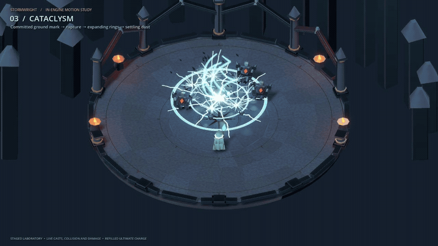
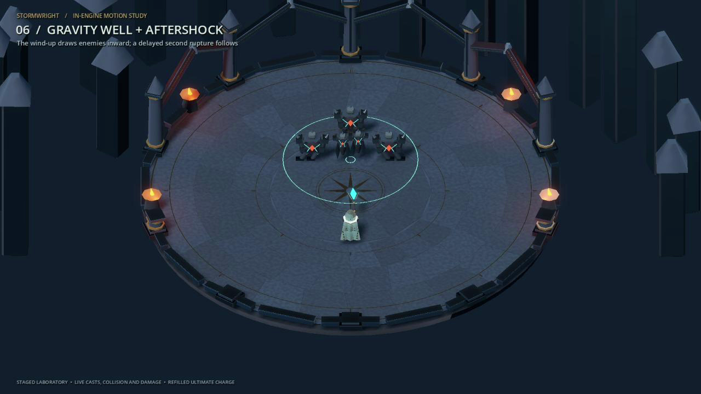
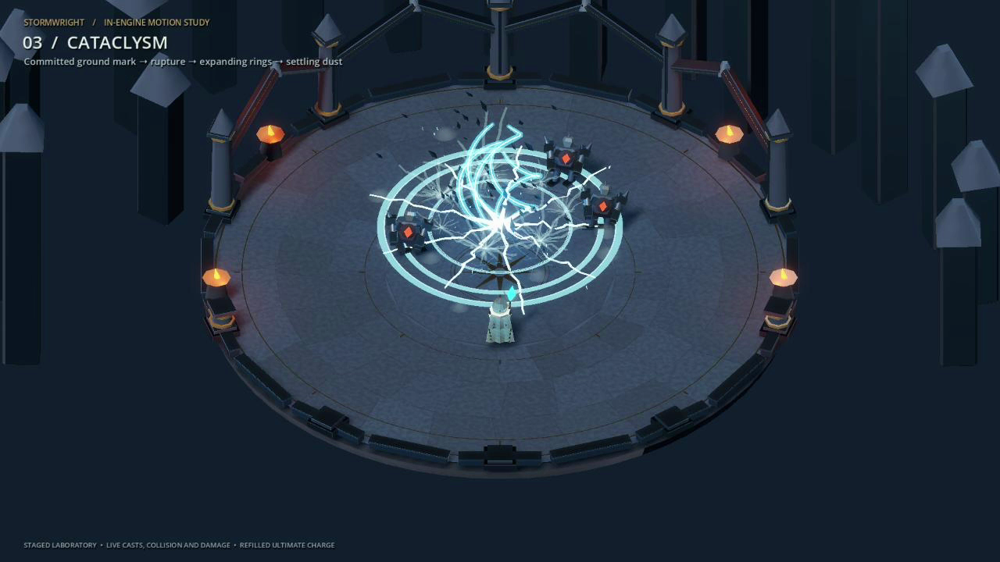

# Stormwright

Bend three storm spells into your own build and tear through an arena of enemies.

**[▶ Play in browser](https://kpetrovski.me/play/stormwright/)**

## How to play

- **WASD/arrows** move; **mouse** aims; **Space** dashes.
- **Left mouse** casts Storm Lance; **right mouse** casts Storm Crown.
- Land hits to charge **Q: Cataclysm**. **Escape** pauses.
- Enter the Circuit for six encounters and the Tempest Warden, or experiment immediately in the Spell Laboratory.

Choose from eight modifiers with three equipped slots. Desktop keyboard and mouse are required; mobile touch controls are not implemented.

The hero is a staged Spell Laboratory recording using production spell effects. [Watch the original showcase with sound](outputs/gameplay/spell-showcase.mp4).

## Development

Godot 4.7.2, GDScript; procedural geometry and synthesized audio.

Open `project.godot` in Godot 4.7.2 and press **F5**.

[Development, verification, and deployment notes](DEVELOPMENT.md).
