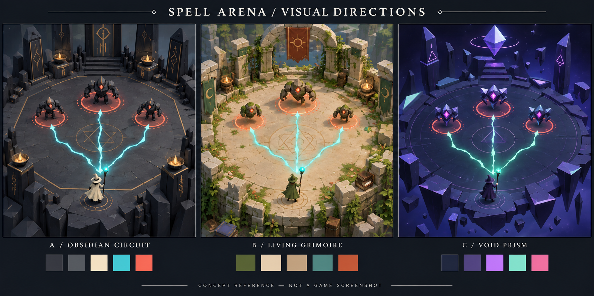

# Godot setup — ready for review

Prepared on 2026-09-08. **Update: game implementation is approved and the
[PRD has been authored](SPELL_ARENA_PRD.md).** See `docs/review/approval.md` for status.
The proposal below records the original setup review; the PRD supersedes its scope.

## What is ready

| Component | Result |
| --- | --- |
| Godot execution | Local Godot 4.7.2 detected and run successfully. |
| Feedback | Import logs, error detection, replay assertions, JSON telemetry, rendered PNG capture. |
| Documentation | Verified official 4.7 manuals and local API signatures for 1,076 classes from the installed engine. |
| Godot skill | Project-local `.agents/skills/godot-development/SKILL.md`; explicitly referenced by AGENTS.md. |
| Project guidance | Root AGENTS.md includes the approval boundary and your `kp/` PR branch prefix. |
| Playground | Separate `dev/playground/project.godot`; 3D calibration geometry, input probe, collision wall, camera and HUD. |
| Visual references | Three original concept directions in `visual-directions.png`. |

## Verification

Both the headless replay and the rendered replay passed:

- Input moves the probe.
- Collision stops the probe at the wall.
- Reverse input moves it away.
- Reset restores its original position.
- The rendered run saves a real 1280 × 720 Godot viewport image.

See [the actual playground capture](playground.png) and
[rendered state](playground-state.json). The image was visually inspected for
geometry, framing and legible diagnostic text. Rendering used the Compatibility
renderer on Apple M5 Pro. These short tests verify the development workflow;
they are not a game performance benchmark.

The initial sandboxed import failed on Godot's normal macOS cache/application-data
writes. It was correctly caught despite exit code zero. Authorized execution with
normal macOS access passed. Future sandboxed sessions may request that same access.

## Visual direction to approve



| Option | Direction | Development tradeoff |
| --- | --- | --- |
| **A — Obsidian Circuit (recommended)** | Faceted dark stone, ivory caster, cyan player magic, coral danger, sparse brass runes. | Strong readability and reusable modular geometry; a good fit for procedural modeling and spell effects. |
| **B — Living Grimoire** | Warm stone, parchment, moss, miniature-like magical ruins. | Warmer tone; foliage and surface detail add art work. |
| **C — Void Prism** | Floating geometric arena, navy/violet, mint spells, crystalline enemies. | Smallest environment asset burden; brightness and effect overlap need careful tuning. |

These are concept references, not a promise of one-pass visual fidelity. The first
build would establish silhouettes, camera, palette and readable effects before
adding surface detail. The board's enemy designs and decorations are illustrative.
The exact generation prompt and tool provenance are in [visual-prompt.md](visual-prompt.md).

Proposed common visual rules: elevated orthographic gameplay camera, clear arena
floor, distinctive player/enemy silhouettes, restrained spell trails, and danger
indicated by both color and shape. Preserve readability when multiple effects overlap.

## Proposed first build after approval

Assuming the intended game is the spell arena discussed earlier:

1. One small 3D arena, movement, mouse aim and restart.
2. One projectile and one enemy with readable attack feedback.
3. One wave leading to one modifier choice, then another fight.
4. Targeted replay checks and rendered inspection of the complete loop.

WASD movement and mouse aiming are proposed controls. Renderer and root project
settings will be read from the project you create before implementation. The
diagnostic project's Compatibility renderer does not decide the game's renderer.

## Using the kit

From the repository root:

```sh
python3 tools/godot_dev.py doctor
python3 tools/godot_dev.py playground
python3 tools/godot_dev.py playground-test
python3 tools/godot_dev.py playground-capture
```

In the interactive playground: WASD moves, R resets, F12 saves a screenshot and
state, Escape exits. Automated runs save their evidence under `work/runs/`.
Full command and documentation guidance is in `docs/godot/development.md`.

The root `project.godot` was not created or edited by this setup. The diagnostic
project is excluded from root imports through `dev/.gdignore`. No combat, spells,
enemies, progression or production game assets have been implemented.

The setup does not require an MCP server. It verifies in-process scripted input and
viewport capture, not remote editor scene-tree control or OS keyboard automation.
Game-specific development hooks will be added only once implementation is approved.

**Current next step:** implement the full scope of `outputs/SPELL_ARENA_PRD.md`.
The original visual options and preliminary slice above remain proposals unless
the PRD or later user instructions select or refine them.
