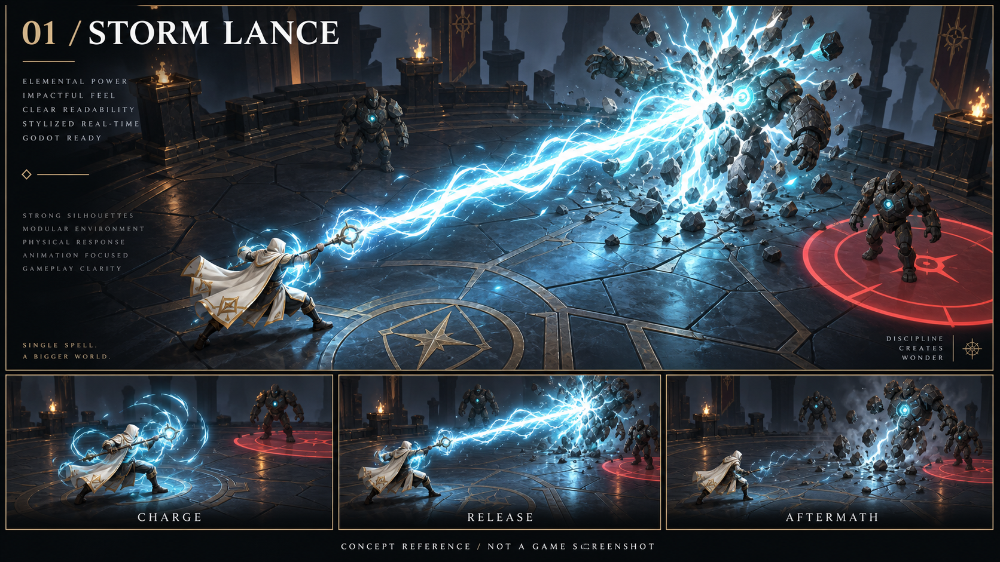
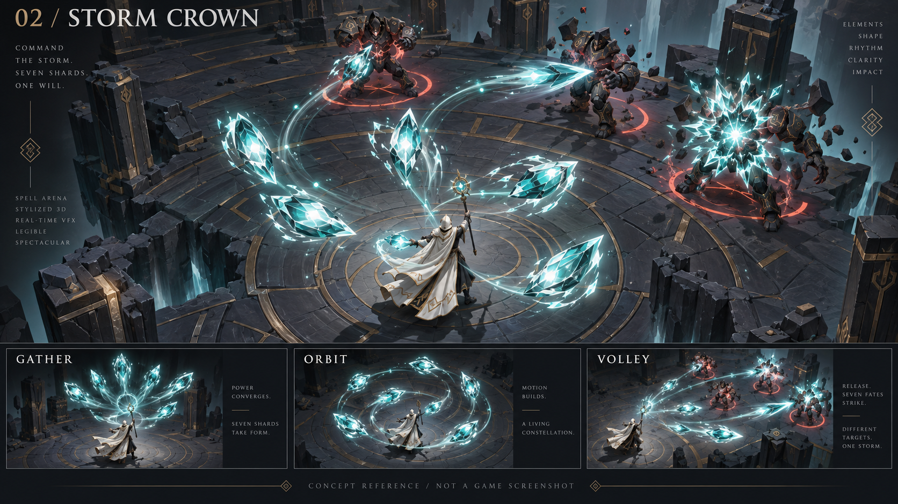
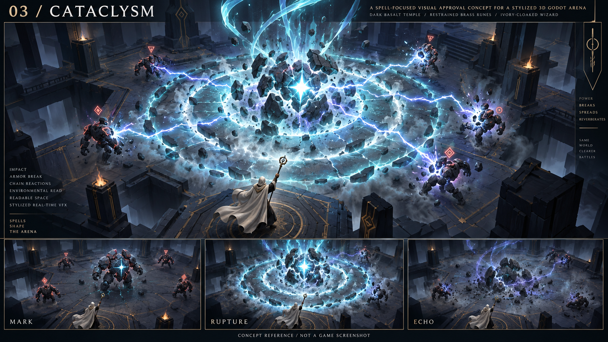

# Spell spectacle references

These three completed concept boards explore spells as the game's main visual
attraction. They share the dark basalt and ivory-caster palette as a comparison
baseline; the environment direction remains open for refinement in the PRD.

## 01 — Storm Lance

A concentrated discharge with a turbulent sheath, branching filaments and a
fracturing impact. The cast moves through anticipation, release and aftermath.
Look for the balance between beam thickness, visible caster pose and enemy recoil.

## 02 — Storm Crown

An orbiting constellation transforms into a rhythmic volley. The spell's silhouette
and behavior change, with separate trajectories and timed impacts. Look for the
shard scale, orbital shape and readability of multiple simultaneous effects.

## 03 — Cataclysm

Charge builds inside targets before a delayed rupture sends shock rings across
the floor and arcs into adjacent enemies. Look for the desired maximum intensity,
physical reactions and dark gaps that keep the fight understandable.

## Review criteria

- Are these powerful enough for the game's central spectacle?
- Which shapes, colors and impact details should carry into the first spell?
- Should the effects feel more arcane, elemental, geometric or chaotic?

These are generated visual targets, not implemented gameplay or evidence of
real-time performance. Motion is proposed through sequential still frames;
animation quality and fluidity will need in-engine verification during implementation.
Exact prompts are saved in `PROMPTS.md`. Game implementation was separately approved
on 2026-09-08; the [PRD](../SPELL_ARENA_PRD.md) now defines the complete scope.
